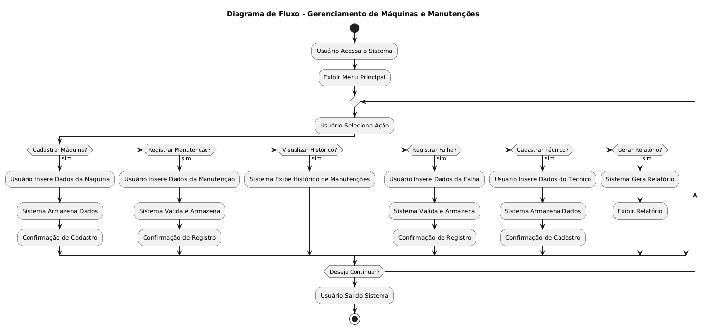
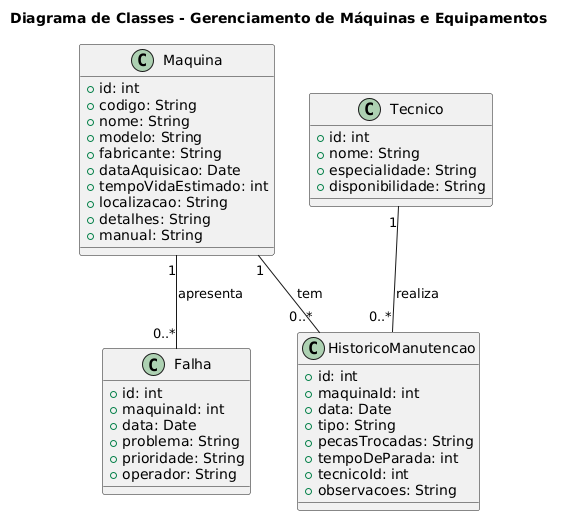
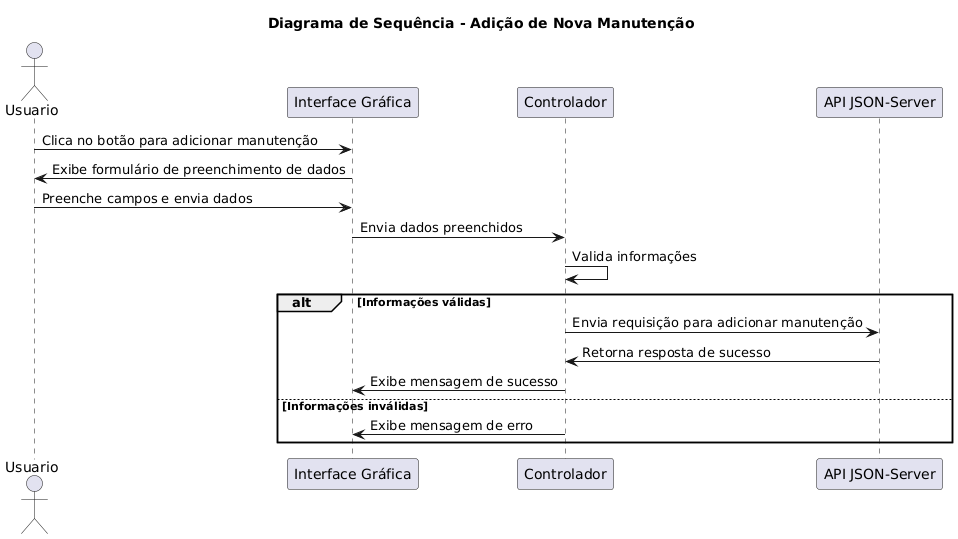

# Escopo do Projeto de Gerenciamento de Máquinas e Equipamentos

## 1. Análise de Requisitos e Escopo

### Funcionalidades Principais

- **Gerenciamento de Máquinas e Equipamentos**
  - Cadastro de máquinas com especificações técnicas, data de aquisição e localização.
  - Visualização e edição de informações de máquinas.

- **Registro e Controle de Manutenções**
  - Registro de manutenções preventivas e corretivas.
  - Histórico completo de manutenções para cada máquina.
  - Registro de peças substituídas e tempo de inatividade.

- **Gerenciamento de Falhas**
  - Registro de falhas ocorridas, com classificação de severidade e identificação do operador.
  - Controle de falhas por máquina.

- **Gerenciamento de Técnicos**
  - Cadastro de técnicos com suas especialidades e disponibilidade.

- **Relatórios e Indicadores**
  - Geração de relatórios de manutenção, tempo de inatividade, falhas e peças trocadas.
  - Cálculo de indicadores como MTTR (Mean Time to Repair) e MTBF (Mean Time Between Failures).

- **Integração com API**
  - Utilização de uma API REST (JSON-Server) para armazenamento e recuperação de dados.

### Requisitos Funcionais

- O sistema deve permitir o cadastro de máquinas com suas especificações.
- O sistema deve registrar manutenções preventivas e corretivas, associando técnicos e peças trocadas.
- O sistema deve gerar relatórios de manutenção e indicadores de performance.
- O sistema deve oferecer uma interface gráfica intuitiva para o usuário final.

### Requisitos Não Funcionais

- O sistema deve ser responsivo, com tempo de resposta rápido ao realizar operações com a API.
- A interface deve ser amigável e permitir fácil navegação entre as funcionalidades.
- O sistema deve armazenar e recuperar dados de maneira segura e eficiente.

## 2. Escopo do Projeto

### Objetivos

- Desenvolvimento da interface gráfica utilizando Java Swing para o gerenciamento de máquinas, técnicos e manutenções.
- Implementação de funcionalidades CRUD (Create, Read, Update, Delete) para máquinas, manutenções, falhas e técnicos.
- Geração de relatórios com base nos dados registrados, incluindo indicadores de desempenho.
- Conexão com a API para armazenar e manipular dados em tempo real.
- Realização de validação e testes para garantir a robustez do sistema.

### Levantamento de Recursos

- **Tecnologias:**
  - Linguagem: Java
  - Gerenciamento de dependências: Maven
  - API: JSON-Server

- **Recursos Humanos:**
  - Desenvolvedores Java (experiência com Swing e integração com APIs REST)
  - Testadores (experiência em validação de sistemas)

- **Infraestrutura:**
  - Ambiente de desenvolvimento (IDE Java)
  - Servidor para hospedagem da API JSON-Server

## 3. Análise de Riscos

- **Risco de Atrasos no Desenvolvimento:**
  - **Solução:** Planejamento adequado e definição de marcos.

- **Problemas de Integração com a API:**
  - **Solução:** Testes contínuos durante o desenvolvimento.

- **Mudanças de Escopo:**
  - **Solução:** Controle rigoroso das solicitações de alteração.

- **Desempenho do Sistema:**
  - **Solução:** Testes de carga e otimizações de código.

- **Falta de Documentação:**
  - **Solução:** Manutenção de documentação atualizada durante todo o ciclo de vida do projeto.

## Diagramas

### Diagrama de Fluxo

*Este diagrama ilustra o fluxo geral de ações no sistema.*

### Diagrama de Uso do Sistema

*Este diagrama mostra como diferentes atores interagem com o sistema e suas funcionalidades principais.*

### Diagrama de Classes

*Este diagrama representa as entidades principais do sistema e suas relações.*

### Diagrama de Sequência - Adição de Nova Manutenção

*Este diagrama mostra o fluxo de interação entre os atores e o sistema para a adição de uma nova manutenção.*
